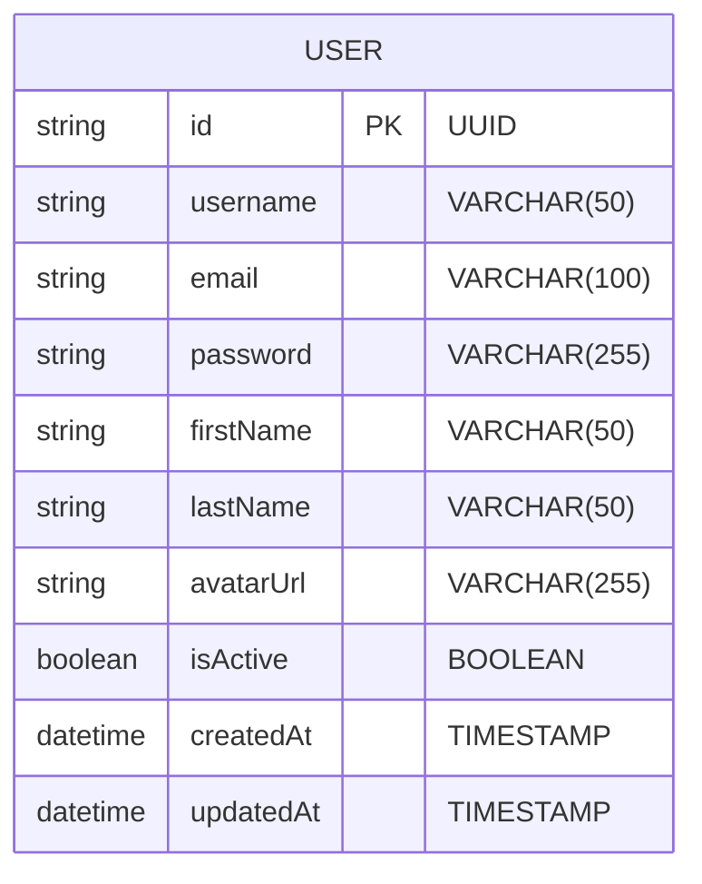
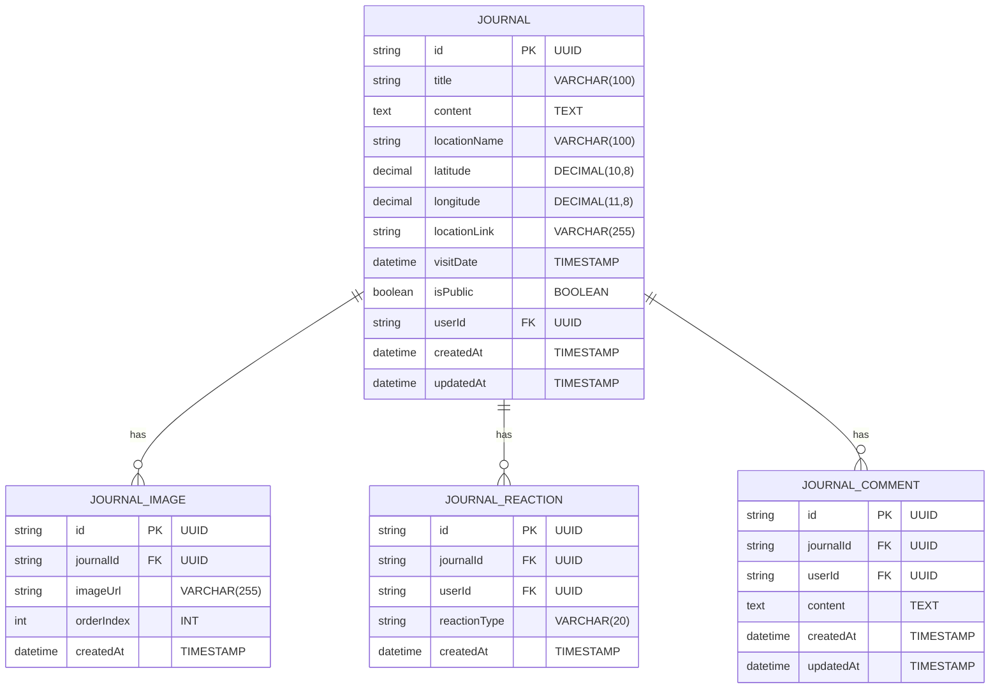

# Database Schema Diagrams

## Fig. 3.1: User Data Schema in MySQL

## Fig. 3.2: Journal Data Schema in MySQL

## Database Schema Explanation

### User Table (Fig. 3.1)
The User table stores information about registered users of the Odyssey Travel Journal application:
- **id**: Unique identifier for each user (UUID)
- **username**: User's chosen username (unique)
- **email**: User's email address (unique)
- **password**: Hashed password for authentication
- **firstName** and **lastName**: User's full name
- **avatarUrl**: URL to user's profile picture
- **isActive**: Account status flag
- **createdAt** and **updatedAt**: Timestamps for record creation and updates

### Journal Table (Fig. 3.2)
The Journal table and its related tables store travel journal entries and associated data:
- **Journal**: Main table for journal entries
  - **id**: Unique identifier for each journal entry
  - **title**: Journal entry title
  - **content**: Main text content of the journal
  - **locationName**: Name of the visited location
  - **latitude** and **longitude**: Geographical coordinates
  - **locationLink**: Link to map location
  - **visitDate**: Date of the visit
  - **isPublic**: Visibility setting
  - **userId**: Foreign key to User table
  - **createdAt** and **updatedAt**: Timestamps

- **Journal_Image**: Stores images associated with journal entries
  - Links to Journal via journalId
  - Includes order index for image sequencing

- **Journal_Reaction**: Stores user reactions to journal entries
  - Links to both Journal and User tables
  - Supports different reaction types

- **Journal_Comment**: Stores comments on journal entries
  - Links to both Journal and User tables
  - Includes content and timestamps 