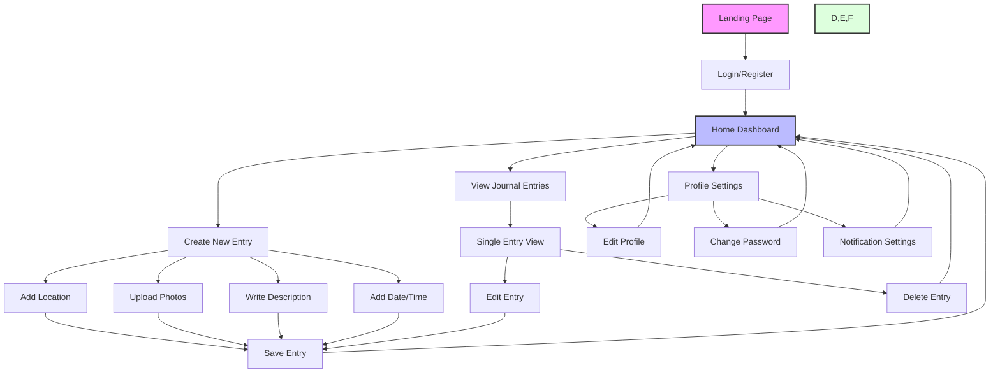

# Travel Journal App Navigation Flowchart

This flowchart (Fig. 2.1) illustrates the navigation structure of the Travel Journal App. It shows the main user flows from the landing page through various features including journal entry management, profile settings, and content creation.

## Legend
- Pink: Entry point
- Blue: Main dashboard
- Green: Primary features
- White: Secondary actions and forms 